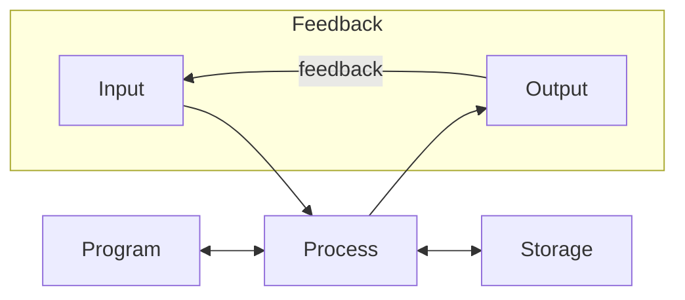

# 3.1 Input, Output, and Storage Devices

## Basic opperating structure for computer systems:


**Each computer system requires:**
- the processing of Data
- the storage of data
- input and output

**Input:**
Any signals from input devices e.g. Mouse, Microphone

**Process:**
Inputs are recieved by a central processing Unit (CPU) which interprets the input and communicates (usually) with a storage device. Decides what to do next

**Storage:**
Information stored on storage devices, e.g. harddrives, SSDs, DVDs, etc.

**Program:**
Provides the CPU/Process with instructions on how to handle inputs and outputs, basically giving the process logic

**Output:**
A system can give output through output devices, e.g. Screen, speaker, electric motor

## Embedded Systems:

= A special single-purpose computer usually embedded in a larger system. Those systems run on so called 'micro controllers'.

Such systems can perform only a select few tasks and are hard to modify/program. Some examples:

| Embedded systems | Non-Embedded Systems |
| :--- | :--- |
| Microwave with processor | Smartphone |
| Hospital devices (E.g. EEG) | Laptop / PC |
| Laundry Machine | |
| Calculator | |

**Important!**
Embedded systems require:
- processor
- memory
- input and outputs

### Benefits:
- cheap to produce
- same embeded system required in many different applications

### Problems:
- hard to re-programm
  -> ungraceful with development mistakes
- very low memory - challenging programmers
- network capable versions have low security standards
  -> Bot-nets

---

## Data Storage:

### Primary vs Secondary Storage
RAM, ROM, Cache (not register!)

The storage usually closest to the system is the RAM which can be accessed directly by the CPU.

Long-term storage refered to as (file-) store would then be a secondary storage device

Secondary Storage is cheaper and used to compromise cost. It is slower, takes up more space, but has a higher capacity for less money.

Primary storage is expensive and used for the internal processes that have to run fast. It is significantly faster, but has a lower information density, costs more and has usually a smaller capacity.

### Types of storage devices?
-   **Integral Storage:** build into the machine/chip e.g. hard drive
-   **External Storage:** storage that can easily be connected or disconnected peripheral storage from a device, e.g. USB stick, DVD
-   **Remote/Cloud storage:** Accessible via network, e.g. SAN (storage area network) or cloud

| Common Data Output: | Common Data Input: |
| :--- | :--- |
| - display | - mouse/controller/keyboard |
| - printer | - touch screen input |
| - speaker | - scanner |
| - output to storage device | - microphone |
| - transmission over a network | - read from storage device |
| | - recieving transmissions over a network |

All inputs and outputs of a computer are handeled by an I/O subsystem. It also handles memory.

---

## Main Memory:
...directly accessible by CPU: RAM, ROM, (cache) sometimes

**volatile memory:** faster, but looses its data when power is lost
**non-volatile memory:** slower, but retains memory when power is lost

RAM and Cache are volatile, ROM is non-volatile memory

### RAM:
(Random Access Memory)

Every programm currently in use is copied or 'loaded' into RAM because it's much faster.
Ram is called Random Access Memory because it takes always about the same time to retreave a certain amount of information from anywhere on the RAM, independent from the previous location accessed.

#### Dynamic RAM (DRAM):
made up of small capacitors which constantly need to refresh their values as they're leaking electricity. Has significantly less components than SRAM.

Slower than SRAM but has a higher bit density, used for Main memory.

#### Static RAM (SRAM):
Stores bits with flip-flop circuits, unlike DRAM memory precists, as long as power is provided -> signal doesn't fade. They are more complex and more expensive to produce.

*access speed*
Faster than DRAM but has a lower bit density, often used for cache.
Embeded systems usually only use SRAM for main memory.

### ROM:
(Read only memory) also a type of RAM

Can't be changed and is used in very small amounts to store essential programms -> e.g. Firmware
Now replaced by the more practical flash storage

-   **simplest form of ROM:** Data is embeded during the creation of the chip -> unchangable
-   **Programmable ROM (PROM)** -> Data can be loaded (after manufacturing) ONCE.
    -> not re-programmable, better for testing as previous
-   **Erasable PROM (EPROM)** -> using ultraviolet light the PROM can be erased and re programmed.
    -> Chip will have to be temporarily removed from circuit
-   **Electrically Erasable PROM (EEPROM)** -> major advantage for development as the chip can stay on the circuit
    -> chip is still used as read-only memory!

### Cache:
Much faster than RAM but with significantly less capacity.
Stores frequently used data, though it's volatile.

**Memory Hierarchy**
```
▲ speed     Register
|           Cache
|           Main Memory
▼ size
```

---

## Buffer:

> \*Even when transfering from a slow to a faster medium, a buffer is still used to ensure a steady smooth data stream

used to match unequal trasmission and reception speeds:
whenever data moves from one part of the system to another it's temporarily stored in a buffer which usually is part of the computer memory.
Information entering the buffer emerges in the same order as it entered the buffer.

---

## Practice Questions:

**3.01** When loading a computer game from storage to the significantly faster RAM it would be reasonable to use a buffer in order to compensate for the difference in speed. The buffer smooths out the single data packets that come in intervals from the secondary storage.

---

## Exam Style Questions

**1 a)**
i. Information on the RAM can be changed why the ROM is read-only. RAM is volatile, while ROM is non-volatile, therefore precists even in the abscence of power.
ii. Both have the random, or "direct" access capability, both are a type of RAM.
iii. DRAM is Dynamic RAM. It's made up of capacitors, needs constant refreshes to not loose its data, is slower than SRAM but has a higher bit density. DRAM is cheaper. SRAM is Static RAM. It's made up of flip-flop circuits which are faster then DRAM but take up more space. Therefore the bit density for SRAM is lower.

**4. a)** Hard disk: a fast rotating disk that stores data through magnetic encodings on that disk. -> magnetic medium
DVD-RW: a fast spinning disk that uses optics to read and write from to the disk (LASER). It stores data as indents of different lengths in its surface. -> optical medium
**b)** haven't done... Flash memory -> solid state medium

**5. a)** see 1A
**b)** 
| Dynamic RAM | Static RAM |
| :--- | :--- |
| uses capacitors for data storage | uses flip-flops for data storage |
| requires constant refreshes | doesn't require constant refreshes |
| is very compact due to the few components per cell | is less compact due to complex circuitry. |