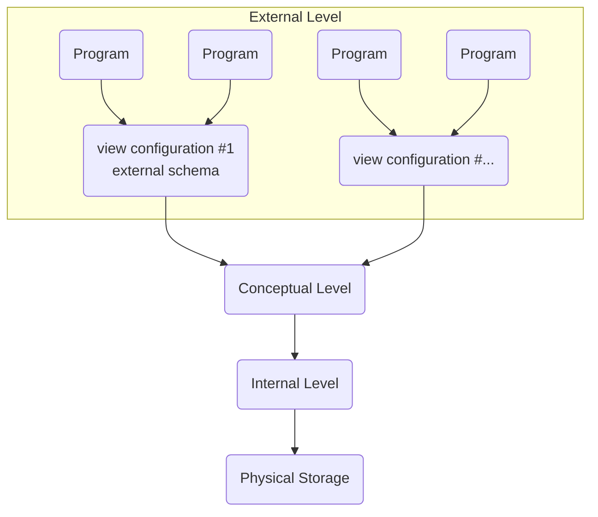

# 8.4 Database Management System
=> DBMS provides tools to create, retrieve, update, and manage data inside databases

## Database Model as of ANSI
=> ANSI: American National Standards Institute
- Division into three levels:
    - external level
    - conceptual level
    - internal level
    (all managed by DBMS)
- all is on top of the physical storage

## Database Seperated From Storage - Internal Level
- only the internal level is concerned with the actual memory addresses and provides a layer of abstraction
    - it performs all physical changes on the storage medium

## Universal View of the Database - Conceptual Level
- The conceptual level provides access to all data in the data base
- It provides an all including universal view
    - only the Database Administrator (DBA) has access
    - a view is refered to as a 'logical schema'

## External Schemata and Access Management - External Level
- The external level defines different logical schemata that have different permissions
    - show only x to y
    - only read, don't edit, etc.
- external schemata provide customized views that improve efficiency

## Developer Interface
- The DBMS provides a developer interface
    - allows developers to communicate instructions with SQL
- A query processor takes queries (SQL instructions) and processes them
- Queries can manipulate and retrieve data

## Reports
=> The DBMS can create reports which are predefined views of partially processed data

## Tools for the Database Administrator (DBA)
- tools for defining access rights

### Indexes
- the DBA controls and creates indexes.
- Indexes are secondary tables that hold pointers to where data is stored
    - way faster to search through them than through actual data
    - pointers point to entities (tuples) in the original table
- Indexes can be on a primary or secondary key
    - (Secondary key = an attribute where all values are unique, but it's not the primary key)

### Data Dictionaries
- only the database administrator has access to the database's data dictionary
- It contains metadata about the data:
    - e.g. attribute names, table names
    - relations between tables
- information on how the physical storage is structured
    - only high level, e.g. storage space & performance
    - DBA accesses conceptual level, not internal level

## Data Security
- a half completed instruction is very dangerous to data integrity
    - leaves the whole database corrupt / in an undefined state
    - undefined state: data is only partially updated and 'in limbo' until query either fails or completes
- The DBMS has to prevent half-executed queries
- DBMS also is responsible for regular backups

---

## Exam Style Question 5b i, ii
i. ~~Relationships between relations (tables) are created by the database administrator using querries. Using the DBMS developer interface he can querry the creation of both linked relation by sending sql commands to the querry processor.~~
ii. many-to-one [many Class-Group, one Student]
i. In the Class-Group Relation, the Class ID is a foreign key which links to a primary key in Class. This is most likely going to be class ID. ✓